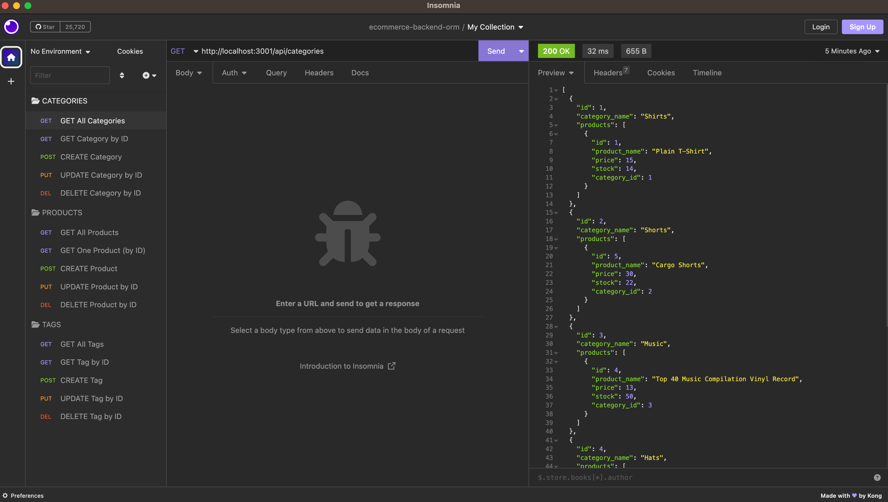

# E-Commerce Back End ORM (Object-Relational Mapping)

## Description
This project was a challenge assigned to us where we had to build the back end for an e-commerce site by modifying starter code. We had to configure a working Express.js API to use Sequelize to interact with a MySQL database.

This challenge was a better experience for me since we were given starter code, though the amount of starter code was initially overwhelming. After breaking it down and following the README guide and tips, it started to make more sense to me. The back end continues to be a tricky concept than previous ones and I am still not there yet when it comes to understanding all the syntax but after completing this challenge, I am another step closer to comprehending how everything works. One of the challenges I ran into was having associate data show up in some of the GET routes, after having some help it turned out to be a typo in the word 'include' that prevented the data from showing up in all my get requests. I also have not yet found the solution to displaying the decimal places for the prices of items instead of just rounding the price to the nearest whole number.


## User Story
```
-AS A manager at an internet retail company
-I WANT a back end for my e-commerce website that uses the latest technologies
-SO THAT my company can compete with other e-commerce companies
```

## Acceptance Criteria

```md
GIVEN a functional Express.js API
WHEN I add my database name, MySQL username, and MySQL password to an environment variable file
THEN I am able to connect to a database using Sequelize
WHEN I enter schema and seed commands
THEN a development database is created and is seeded with test data
WHEN I enter the command to invoke the application
THEN my server is started and the Sequelize models are synced to the MySQL database
WHEN I open API GET routes in Insomnia for categories, products, or tags
THEN the data for each of these routes is displayed in a formatted JSON
WHEN I test API POST, PUT, and DELETE routes in Insomnia
THEN I am able to successfully create, update, and delete data in my database
```

## Usage


[Link to Repository](https://github.com/crzn24/ecommerce-backend-orm.git)

[Walkthrough Video Demo](https://drive.google.com/file/d/1dbPvPw39aBZk8Qf83ViuUGSDYZVoimSk/view?usp=sharing)




## Credits
* [Sequelize Model Documentation](https://sequelize.org/docs/v6/core-concepts/model-basics/)
* [Sequelize Model Validations & Constraints](https://sequelize.org/docs/v6/core-concepts/validations-and-constraints/)
* [Sequelize Associations](https://sequelize.org/docs/v6/core-concepts/assocs/)
* [Sequelize Data Types](https://sequelize.org/docs/v7/other-topics/other-data-types/)

## License
